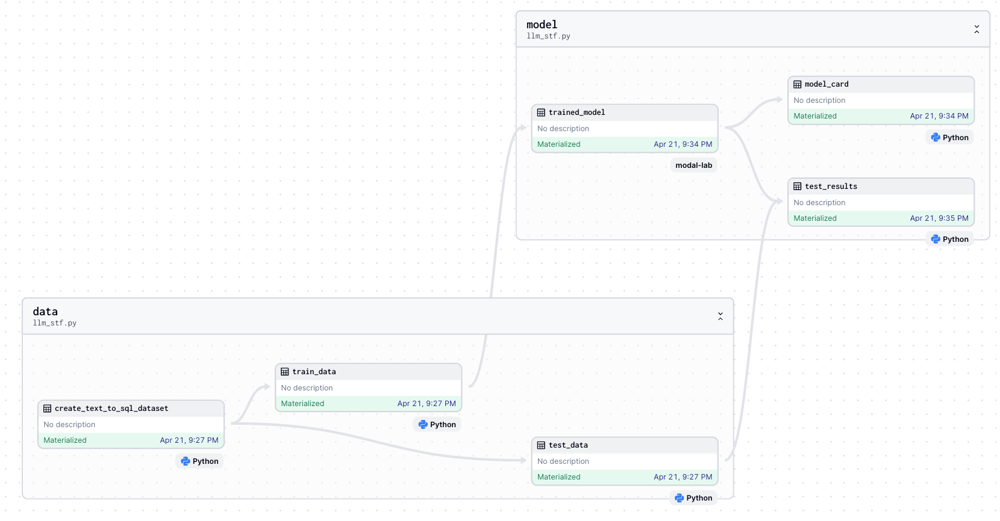

# fine-tune-llms-in-2024-with-trl

Full code for [“How to Fine-Tune LLMs in 2024 with Hugging Face”, but with Dagster, Modal and Llama3!](https://kyrylai.com/2024/04/21/how-to-fine-tune-llms-in-2024-with-hugging-face-but-with-dagster-and-modal/) blog post.


## TLRD: Traing LLama3 with Dagster and ModalLab





## Docker setup

```
make docker_build
make docker_run
```

## Access to have: 

Make sure you have .env file with next variables: 

```
HF_TOKEN=hf_
HF_TOKEN_WRITE=hf_
MODAL_TOKEN_ID=ak-
MODAL_TOKEN_SECRET=as-
```

